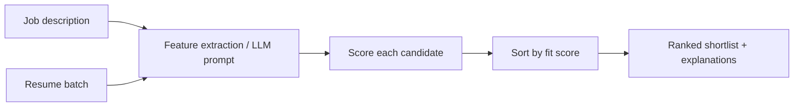

# Architecture

The project has two scoring paths.

## 1. Lightweight Baseline

The default pipeline is deterministic and runs without external ML services. It extracts recruiter-readable features from a resume/job pair:

- Required skill match
- Preferred skill match
- Keyword similarity
- Experience match

These features are combined into a 0-100 fit score. The baseline can be trained on labeled pairs with simple gradient descent and saved as JSON.

## 2. LLaMA-3 LoRA Fine-Tuning

The optional fine-tuning script prepares resume/job examples as instruction prompts and trains LoRA adapters on recruiter-labeled scores. This path is intended for GPU environments with Hugging Face, PEFT, TRL, and Transformers installed.

## Data Flow

## Why Keep the Baseline?

The baseline is fast, explainable, and useful for demos, regression tests, and sanity checks. The LoRA path is better for nuanced matching once enough high-quality labeled data is available.

